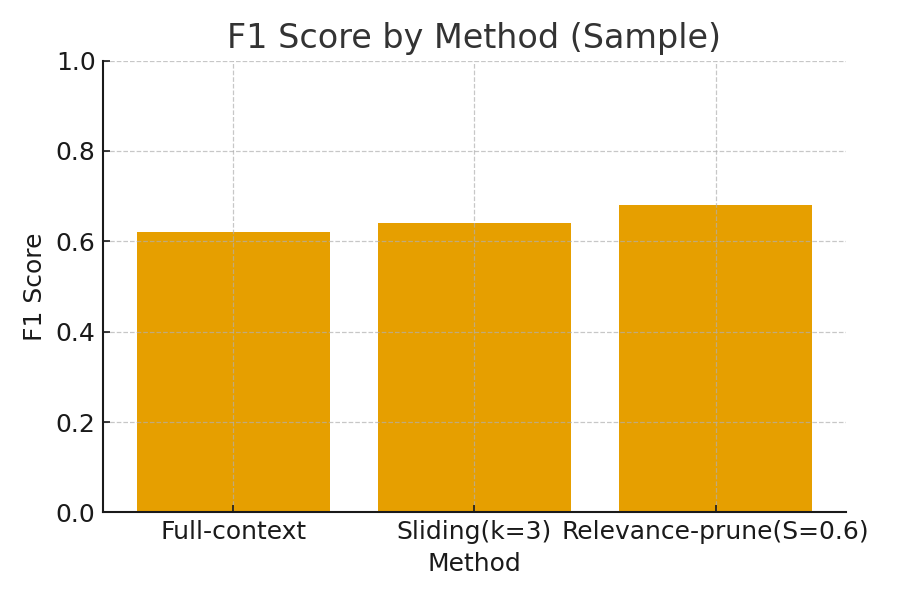
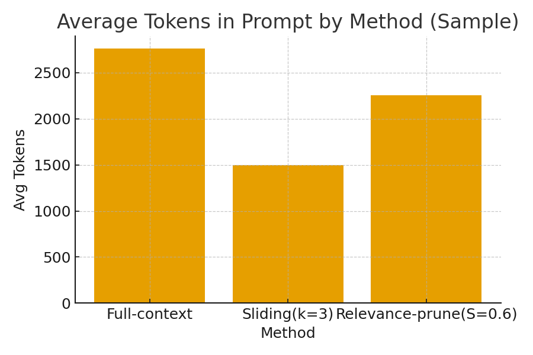
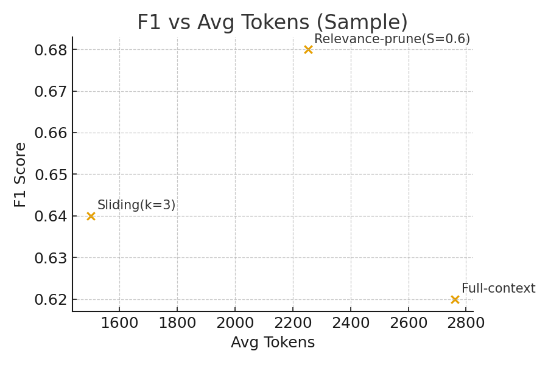

# 🧠 Improving Chatbot Accuracy using Context Window Optimization

This repository accompanies the research paper:
> **"Improving Chatbot Accuracy using Context Window Optimization"**

> *Author:* Gaurav Kumar, Sagar Singh

> *Affiliation:* Independent Researchers, India

> *Email:* gauravatwork17@gmail.com, sagarsinghatwork@gmail.com 
---

## 🧩 Overview

Large conversational language models perform better when they receive **the right context**, not necessarily *more* context.  
This project explores **context window optimization** techniques to improve chatbot accuracy, efficiency, and cost.

We compare:

1. **Full Context** (baseline)  
2. **Sliding Window** (keep last *k* turns)  
3. **Relevance-based Pruning** (select only the most relevant turns using embeddings)

---

## 🚀 Project Goals

- Reduce unnecessary token usage while maintaining or improving accuracy.  
- Compare traditional full-context input vs optimized context selection.  
- Evaluate with automatic metrics (F1, EM, ROUGE) and human scores (factuality, relevance, fluency).  
- Provide a **reproducible open-source framework** for further experiments.  

---

## ⚙️ System Architecture

**Workflow:**

1. User sends query `q`.  
2. System embeds query + past conversation turns.  
3. Calculates cosine similarity for relevance.  
4. Selects optimal subset of context using threshold `S` and delta pruning.  
5. Sends optimized prompt to LLM (GPT-3.5 or Llama2).  
6. Evaluates response accuracy, token cost, and speed.

📊 The figure below shows how pruning affects accuracy and efficiency.

### Figures (Generated Example)

| Figure | Description |
|--------|-------------|
|  | F1 Score by Method |
|  | Average Tokens in Prompt |
|  | Trade-off between Accuracy and Tokens |

---

## 📁 Repository Structure

```
chatbot-context-opt/
├── paper.docx                     # Research manuscript
├── code/                          # Core scripts
│   ├── embeddings.py              # Sentence embedding module (SBERT)
│   ├── context_selector.py        # Context selection logic
│   ├── run_experiments.py         # Main experiment runner
│   ├── plot_results.py            # Generate result plots
│   └── fill_results.py            # Auto-insert results into .docx
├── data/
│   └── sample_results.csv         # Example evaluation metrics
├── figures/
│   ├── f1_scores.png
│   ├── avg_tokens.png
│   └── f1_vs_tokens.png
├── requirements.txt               # Required Python libraries
├── README.md                      # You are reading this
├── LICENSE                        # MIT License
└── .gitignore
```

---

## 🧠 How to Run Experiments

### 1️⃣ Install dependencies
```bash
pip install -r requirements.txt
```

### 2️⃣ Prepare your data
- **Option A:** Create your own synthetic chat dataset.  
- **Option B:** Use public QA datasets like CoQA or MultiWoZ.

### 3️⃣ Embed and select context
```python
from embeddings import embed_texts
from context_selector import select_by_threshold
```

### 4️⃣ Run your tests
```bash
python code/run_experiments.py
```

### 5️⃣ View results
Results will be saved in `/data/sample_results.csv`.

### 6️⃣ Generate figures
```bash
python code/plot_results.py data/sample_results.csv
```

### 7️⃣ Update paper with results
```bash
python code/fill_results.py improving_chatbot_context_optimization.docx data/sample_results.csv
```

---

## 📊 Example Results (Synthetic Data)

| Method | EM   | F1   | ROUGE-L | Avg Tokens |
|--------|------|------|---------|------------|
| Full-context | 0.60 | 0.62 | 0.10 | 2762 |
| Sliding (k=3) | 0.62 | 0.64 | 0.11 | 1500 |
| Relevance-Prune (S=0.6) | 0.66 | 0.68 | 0.12 | 2253 |

---

## 🧪 Planned Experiments

| Goal | Metric | Expected Outcome |
|------|--------|-----------------|
| Reduce prompt length | Avg Tokens | ↓ 30–50% |
| Maintain accuracy | F1 / EM | ≥ Baseline |
| Improve relevance | Human score | ↑ 10% |
| Cost reduction | Token usage | ↓ 25% |

---

## 📘 Publication Info

- Category: cs.CL (Computational Linguistics) or cs.AI  
- License: CC BY 4.0  
- Expected Upload: [Insert date]  

**Citation (once published):**
```
Gaurav Kumar, "Improving Chatbot Accuracy using Context Window Optimization", arXiv:XXXX.XXXXX, 2025
```

---

## 📚 References

- Lewis, P. et al. “Retrieval-Augmented Generation for Knowledge-Intensive NLP Tasks.” NeurIPS (2020)  
- Reimers, N. & Gurevych, I. “Sentence-BERT: Sentence Embeddings using Siamese BERT-Networks.” EMNLP (2019)  
- OpenAI GPT API Documentation  
- LangChain Framework  

---

## 🧾 License

This project is licensed under the MIT License – feel free to use and modify with attribution.

---

## ✨ Acknowledgements

Special thanks to ChatGPT (OpenAI) for research assistance, pseudocode generation, and report structuring support.

---

## 📬 Contact

For questions, collaborations, or implementation help:  
**Gaurav Kumar** — [gauravatwork17@gmail.com]

**LinkedIn:** [Gaurav K](https://www.linkedin.com/in/gauravconnects/) 


**Sagar Singh** — [sagarsinghatwork@gmail.com]

**LinkedIn:** [Sagar S](https://www.linkedin.com/in/sagar--singh/) 

